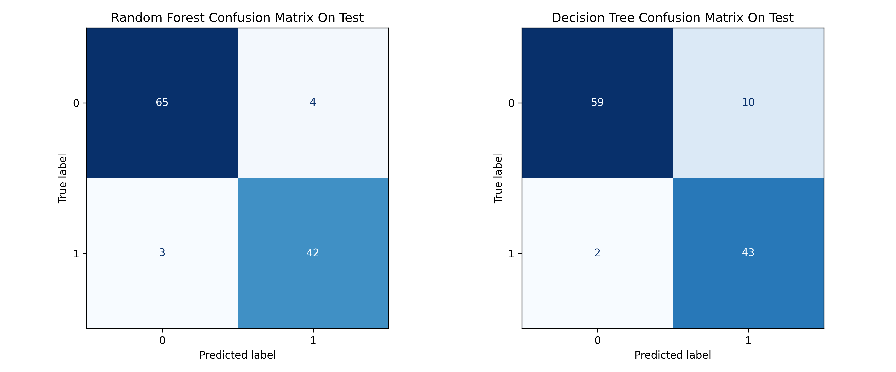
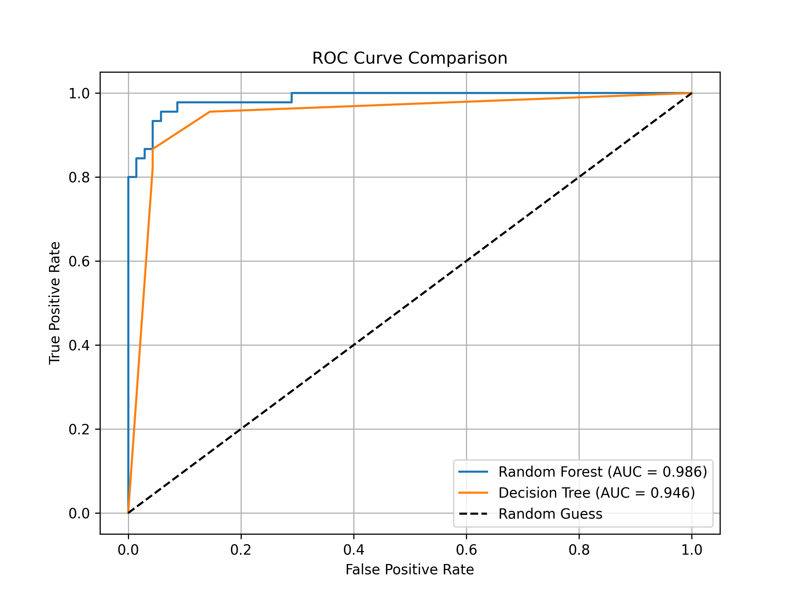
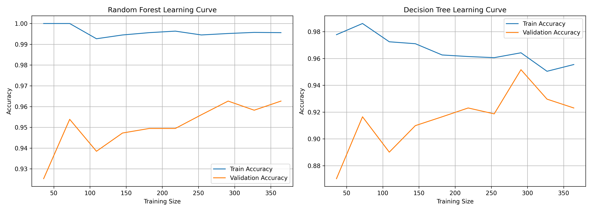

# 🧠 Breast Cancer Classification: Random Forest vs. Decision Tree

This project presents a comparative analysis of two machine learning algorithms—**Random Forest** and **Decision Tree (Post-Pruned)**—on the **Breast Cancer Wisconsin dataset**. The goal is to evaluate their classification performance and generalization capabilities using various metrics and visualizations.

---

## 📊 Dataset

The dataset used is the **Breast Cancer Wisconsin dataset**, which is widely used for binary classification tasks (malignant vs. benign tumors).

---

## 🧪 Models Evaluated

- 🌲 **Random Forest Classifier**
- 🌳 **Decision Tree Classifier (Post-Pruned)**

---

## ✅ Evaluation Metrics

The models were evaluated based on:

- Confusion Matrix
- ROC Curve & AUC Score
- Learning Curves (Train vs. Validation Accuracy)
- Cross-Validation Metrics: Accuracy, Precision, Recall, and F1 Score

---

## 📁 Visualizations

### 🔷 Confusion Matrices (on Test Set)

- **Random Forest**:
  - True Positives: 42
  - True Negatives: 65
  - False Positives: 4
  - False Negatives: 3

- **Decision Tree**:
  - True Positives: 43
  - True Negatives: 59
  - False Positives: 10
  - False Negatives: 2

---

### 📈 ROC Curve Comparison

- **Random Forest AUC**: 0.986
- **Decision Tree AUC**: 0.946

---

### 📉 Learning Curves

- **Random Forest** showed consistently high training accuracy and better generalization (low variance).
- **Decision Tree** had a larger gap between training and validation accuracy, indicating some overfitting despite pruning.

---

## 🔁 Cross-Validation Performance Summary

| Metric     | Random Forest (± std)   | Decision Tree (± std)   |
|------------|--------------------------|--------------------------|
| Accuracy   | **0.9626 ± 0.0256**      | 0.9231 ± 0.0303          |
| Precision  | **0.9629 ± 0.0120**      | 0.8873 ± 0.0581          |
| Recall     | **0.9342 ± 0.0673**      | 0.9105 ± 0.0499          |
| F1 Score   | **0.9472 ± 0.0381**      | 0.8972 ± 0.0401          |

---

## 🧠 Conclusion

- **Random Forest** consistently outperforms the **Decision Tree** across all metrics.
- It achieves higher AUC, accuracy, and F1-score and exhibits better generalization to unseen data.
- **Decision Tree**, while interpretable and lightweight, showed signs of overfitting despite pruning.

---

